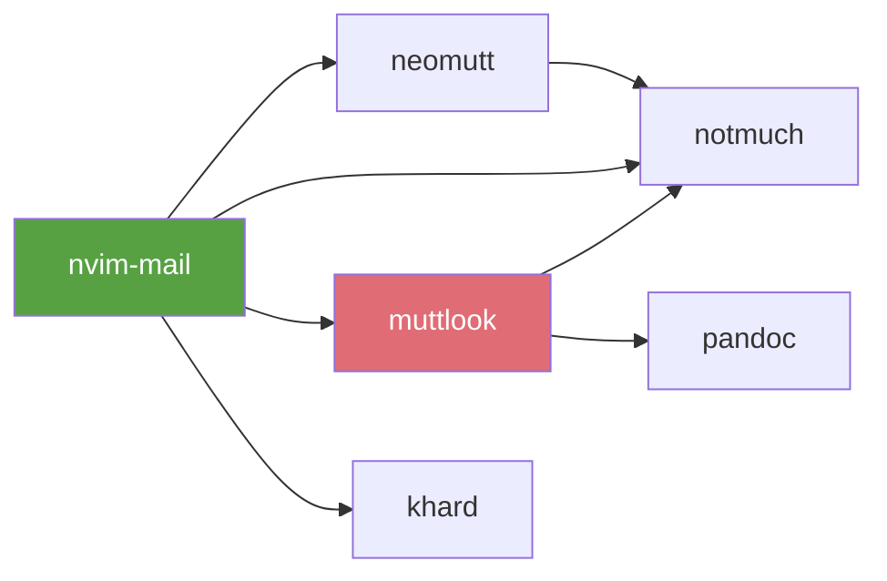

<div align="center">


[](https://github.com/monkeyxite/nvim-mail/actions)

[](https://neovim.io)
[](https://www.lua.org)
[](LICENSE)

[Features](#-features)
•
[Install](#-install)
•
[Keymaps](#%EF%B8%8F-keymaps)
•
[Config](#%EF%B8%8F-configuration)

</div>

---

Pure Lua replacement for [vim-mail](https://github.com/dbeniamine/vim-mail). Designed for the **neomutt + nvr + notmuch** workflow.

## ✨ Features

| Feature | Description |
|---------|-------------|
| 📎 **Attachment awareness** | Warns on save if To:/Subject: empty, headers in body, or "attach" mentioned without attachment |
| 🔗 **Muttlook markers** | Shows `↩ replying to:` and `🔗 thread:` as virtual text |
| 📜 **Thread context** | Opens replied-to message rendered in terminal split below |
| 📇 **Contact completion** | blink-cmp provider for khard, scoped by account |
| 👁️ **Markdown preview** | Renders draft via muttlook and opens in browser |
| ✂️ **Smart snippets** | Context-aware snippets by recipient domain |
| 🧭 **Navigation** | Jump to headers, body, signature, quotes |
| 🔄 **Switch From** | Select sender from configured address list |
| 🗑️ **Kill quoted sig** | Remove quoted signatures from replies |
| 🌐 **Spell cycling** | Cycle through configured spell languages |
| 📅 **Calendar picker** | Telescope calendar via kcal (EventKit, ~85ms), MoM mail compose |
| 🔍 **Contact picker** | Telescope khard+notmuch search, insert/edit/create contacts |
| ✉️ **Smart contact resolve** | `,mC` resolves display names to emails: khard→notmuch→ldap, auto-saves |

## 📦 Dependencies



| Tool | Used by | Required |
|------|---------|----------|
| [muttlook](https://github.com/monkeyxite/muttlook) | Thread context, Preview, Telescope view | Yes |
| [notmuch](https://notmuchmail.org) | Thread context, Contacts, Telescope | Yes |
| [nm-livesearch](https://github.com/dagle/nm-livesearch) | Telescope async search | Yes (for telescope) |
| [nm-html-extract](link) | Telescope preview, Thread context | Yes |
| [icalpal](https://github.com/ajrosen/icalPal) | Calendar picker | No (replaced by kcal) |
| [kcal](https://github.com/monkeyxite/kcal) | Calendar picker (fast, native EventKit) | Yes (for calendar) |
| [khard](https://github.com/lucc/khard) | Contact completion | Yes |
| [telescope.nvim](https://github.com/nvim-telescope/telescope.nvim) | Mail search | Optional |
| [blink.cmp](https://github.com/Saghen/blink.cmp) | Completion framework | Optional |
| [luasnip](https://github.com/L3MON4D3/LuaSnip) | Snippet expansion | Optional |

## 🚀 Install

**lazy.nvim:**
```lua
{
  'monkeyxite/nvim-mail',
  opts = {
    from_list = {
      'Your Name <you@company.com>',
      'Your Name <you@gmail.com>',
    },
    spell_langs = { 'en', 'sv' },
    send_accounts = {
      ['work'] = '-e "source ~/.config/mutt/accounts/work.muttrc"',
      ['personal'] = '-e "source ~/.config/mutt/accounts/personal.muttrc"',
    },
    contacts = {
      from_map = { ['company%.com'] = 'work', ['gmail%.com'] = 'personal' },
      notmuch = true,
      accounts = {
        work = {
          cmd = 'khard', args = { 'email', '-p', '--remove-first-line', '-A', 'work' },
          notmuch_path = 'work',
          from = 'Your Name <you@company.com>',
        },
        personal = {
          cmd = 'khard', args = { 'email', '-p', '--remove-first-line', '-A', 'personal' },
          notmuch_path = 'personal@gmail.com',
          from = 'Your Name <you@gmail.com>',
        },
      },
    },
  },
}
```

## ⌨️ Keymaps

All under configurable prefix (default `,m`):

### Navigation

| Key | Action |
|-----|--------|
| `,mt` | Go to To: |
| `,mc` | Go to Cc: |
| `,mb` | Go to Bcc: |
| `,ms` | Go to Subject: |
| `,mf` | Go to From: |
| `,mF` | Switch From address |
| `,mR` | Go to Reply-To: |
| `,mB` | Jump to body |
| `,mS` | Jump to signature |
| `,mr` | Jump to first quote |
| `,mE` | End of reply |
| `,mk` | Kill quoted sig |
| `,ml` | Cycle spell lang |

### Compose & Send

| Key | Action |
|-----|--------|
| `,mm` | Send mail (account detection + muttlook + neomutt) |
| `,mq` | Quote selection (normal + visual) |
| `,mi` | Paste image from clipboard (CID path) |
| `,ma` | Sync contacts (khard) |
| `,mT` | Thread context (terminal split) |
| `,mp` | Preview as HTML (muttlook) |
| `,mC` | Resolve display names → emails in To/Cc/Bcc (khard→notmuch→ldap) |
| `,mK` | Contact picker (telescope) |

### Automatic

| Trigger | Action |
|---------|--------|
| `:w` | Warns if To: empty, Subject: empty, headers found in body, or "attach" mentioned without attachment |
| Buffer open | Muttlook markers shown as virtual text |
| Buffer open | Treesitter markdown, spell, luasnip |
| `To:/Cc:/Bcc:` | Contact completion (blink-cmp: khard + notmuch) |
| `.eml` / `/tmp/neomutt-*` | Auto-detected as `mail` filetype |

## 🎯 Snippets

Via vscode JSON format (`snips/snippets/mail.json`):

| Trigger | Expands to |
|---------|-----------|
| `mbr` | Best regards,\n*name* |
| `mty` | Thanks for the update. |
| `mpfa` | Please find attached. |
| `mfyi` | FYI — *context*. |
| `mack` | Acknowledged, will follow up by *date*. |
| `mch` | Cheers,\n*name* |
| `mlmk` | Let me know what you think. |
| `msig` | Best,\n*name* |

## ⚙️ Configuration

```lua
require('nvim-mail').setup({
  prefix = ',m',
  from_list = {},
  spell_langs = { 'en' },
  snippets = {
    name = 'Your Name',       -- used in signature snippet placeholders
    domains = {
      ['work%.com'] = 'work', -- domain pattern → snippet context
      ['gmail%.com'] = 'personal',
    },
    -- Optional: override snippet definitions per context
    -- snippets = { work = { ... }, personal = { ... }, general = { ... } }
  },
  contacts = {
    cmd = 'khard',
    args = { 'email', '-p', '--remove-first-line' },
    from_map = {},
    accounts = {},
  },
})
```

### Blink-cmp provider

```lua
sources = {
  per_filetype = {
    mail = { 'mail_contacts', 'snippets', 'buffer', 'spell', 'path' },
  },
  providers = {
    mail_contacts = {
      name = 'Contacts',
      module = 'nvim-mail.contacts',
      score_offset = 10,
      enabled = function() return vim.bo.filetype == 'mail' end,
    },
  },
}
```

## 🔭 Telescope

Fuzzy search your maildir via `nm-livesearch` (same engine as `nms`):

```lua
require('telescope').load_extension('nvim_mail')
```

```vim
:Telescope nvim_mail search
:Telescope nvim_mail calendar
```

Or bind:
```lua
vim.keymap.set('n', '<leader>sm', require('telescope').extensions.nvim_mail.search, { desc = '[S]earch [M]ail' })
vim.keymap.set('n', '<leader>sc', require('telescope').extensions.nvim_mail.calendar, { desc = '[S]earch [C]alendar' })
vim.keymap.set('n', '<leader>sK', require('telescope').extensions.nvim_mail.contacts, { desc = '[S]earch [K]ontacts' })
```

### Mail picker keymaps

| Key | Action |
|-----|--------|
| `Enter` | Open thread in neomutt |
| `Ctrl+o` | View in browser (muttlook) |
| `Ctrl+r` | Reply — opens draft in nvim buffer (use `,m` to send) |
| `Ctrl+t` | GTD tag (archive/action/waiting/defer/done) |
| `Ctrl+y` | Copy message-id to clipboard |
| `Ctrl+l` | Full styled preview in split (ANSI colors) |
| `Ctrl+n/p` | Next/previous item |
| `Ctrl+d/u` | Scroll preview down/up |

### Calendar picker keymaps

| Key | Action |
|-----|--------|
| `Enter` | Start MoM from template |
| `Ctrl+o` | Open conference URL |
| `Ctrl+r` | Compose MoM mail — instant buffer with display names, cleaned notes, agenda |
| `Ctrl+s` | Switch date (type date in prompt first) |

Calendar supports: `today`, `tomorrow`, `+N`, `-N`, `YYYY-MM-DD` in prompt.
Powered by [kcal](https://github.com/monkeyxite/kcal) — native EventKit, ~85ms vs ~3s for icalpal.

#### Account-aware contact resolution

When creating a MoM or reply from the calendar picker, contacts are resolved using the account associated with the event's calendar. Configure the mapping:

```lua
require('nvim-mail').setup({
  contacts = {
    -- Map calendar names (from kcal) → account names
    calendar_map = {
      ['Calendar'] = 'work',           -- Exchange default calendar
      ['you@company.com'] = 'work',
      ['you@gmail.com'] = 'personal',
    },
    -- Map account → From address (injected into reply .eml)
    account_from = {
      work = 'Your Name <you@company.com>',
      personal = 'Your Name <you@gmail.com>',
    },
    -- Map From: patterns → account (for ,mC resolver in compose buffers)
    from_map = {
      ['company%.com'] = 'work',
      ['gmail%.com'] = 'personal',
    },
    -- Per-account khard address books
    accounts = {
      work = {
        cmd = 'khard',
        args = { 'email', '-p', '--remove-first-line', '-A', 'work' },
        notmuch_path = 'work',
      },
      personal = {
        cmd = 'khard',
        args = { 'email', '-p', '--remove-first-line', '-A', 'personal' },
        notmuch_path = 'you@gmail.com',
      },
    },
    work_domain = 'company.com',
  },
})
```

Resolution priority per account:
1. **khard** — account-scoped address book (`-A work` or `-A personal`)
2. **notmuch** — scoped by `path:work/**` or `path:you@gmail.com/**`
3. **Corporate pattern** — `first.last@work_domain` (work account only)
4. **LDAP** — DavMail corporate directory (work account only)

### Contacts picker (`<leader>sK` / `,mK`)

```vim
:Telescope nvim_mail contacts
```

| Key | Action |
|-----|--------|
| `Enter` | Insert `Name <email>` at cursor |
| `Ctrl+e` | Expand with notmuch addresses (async) |
| `Ctrl+o` | Edit contact in khard |
| `Ctrl+n` | Create new khard contact from entry |
| `Ctrl+y` | Yank email to clipboard |

Loads khard contacts instantly (~300ms). `Ctrl+e` merges notmuch addresses on demand.

### Contact resolution (`,mC`)

Resolves display names in `To:`/`Cc:`/`Bcc:` to emails using a 3-stage pipeline:

1. **khard** — local vcard store, 3 name variants (original, suffix-stripped, first+last)
2. **notmuch** — corporate email pattern (`first.last@company.com`) with transliteration (ä→a, ö→o) and name validation
3. **ldap** — DavMail LDAP as last resort, shows `⏳ LDAP lookup for: <name>` warning

Successful notmuch and ldap results are auto-saved to khard for instant lookup next time.

Features:
- Live results as you type (nm-livesearch async streaming)
- Preview: styled meeting details (attendees, time, location, notes)
- MoM template with attendees pre-filled
- Account-scoped mail search via `notmuch_path` config

## 🧪 Tests

```bash
nvim --headless --clean -u tests/minimal_init.lua \
  -c "PlenaryBustedDirectory tests/mail/ {minimal_init = 'tests/minimal_init.lua'}"
```

52 tests covering: attachment detection, marker parsing, thread commands, navigation, contacts, snippets, preview.

## 📁 Structure

```
lua/nvim-mail/
├── init.lua           — setup, keymaps, autocmds, ,mC resolver
├── attachment.lua     — attachment mention detection
├── marker.lua         — muttlook marker extmarks
├── thread.lua         — nm-html-extract thread in terminal split
├── contacts.lua       — blink-cmp provider for khard
├── contacts_picker.lua — telescope contact picker (khard+notmuch)
├── calendar.lua       — telescope calendar picker (kcal)
├── preview.lua        — muttlook draft preview
├── snippets.lua       — context detection
└── navigate.lua       — header/body/signature navigation
```

## 🔄 Migrating from vim-mail

Drop-in replacement for `dbeniamine/vim-mail`. All navigation keys preserved under the same `,m` prefix. Remove vim-mail from your plugin manager and add nvim-mail instead.

## 📄 License

MIT
