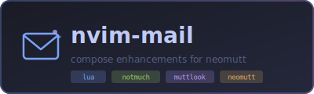
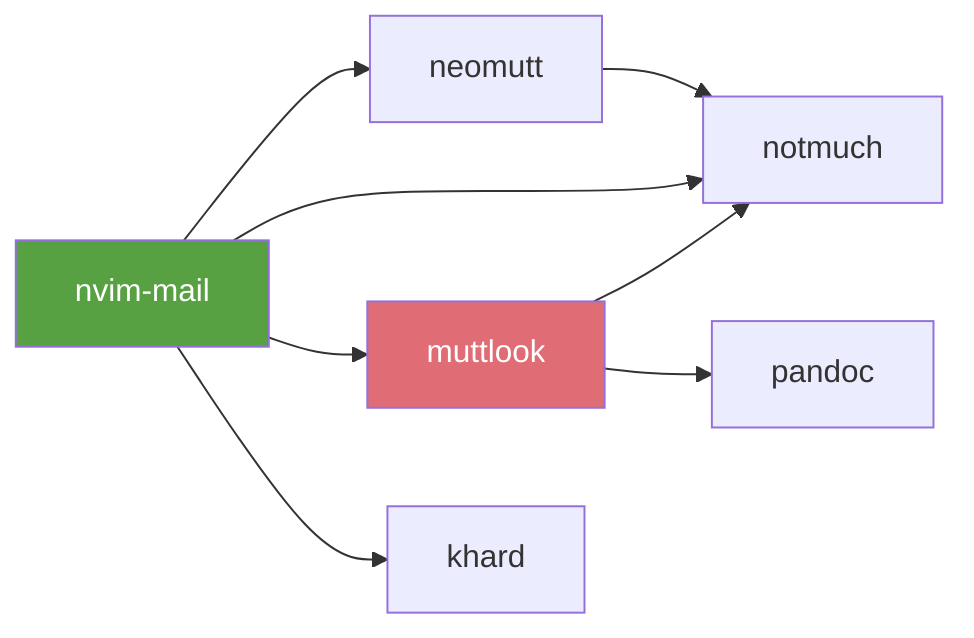

<div align="center">



[](https://github.com/monkeyxite/nvim-mail/actions)
[](https://neovim.io)
[](https://www.lua.org)
[](LICENSE)

[Features](#-features)
•
[Install](#-install)
•
[Keymaps](#%EF%B8%8F-keymaps)
•
[Config](#%EF%B8%8F-configuration)

</div>

---

Pure Lua replacement for [vim-mail](https://github.com/dbeniamine/vim-mail). Designed for the **neomutt + nvr + notmuch** workflow.

## ✨ Features

| Feature | Description |
|---------|-------------|
| 📎 **Attachment awareness** | Warns on save if body mentions "attach" but no attachment marker found |
| 🔗 **Muttlook markers** | Shows `↩ replying to:` and `🔗 thread:` as virtual text |
| 📜 **Thread context** | Opens replied-to message rendered in terminal split below |
| 📇 **Contact completion** | blink-cmp provider for khard, scoped by account |
| 👁️ **Markdown preview** | Renders draft via muttlook and opens in browser |
| ✂️ **Smart snippets** | Context-aware snippets by recipient domain |
| 🧭 **Navigation** | Jump to headers, body, signature, quotes |
| 🔄 **Switch From** | Select sender from configured address list |
| 🗑️ **Kill quoted sig** | Remove quoted signatures from replies |
| 🌐 **Spell cycling** | Cycle through configured spell languages |

## 📦 Dependencies



| Tool | Used by | Required |
|------|---------|----------|
| [muttlook](https://github.com/monkeyxite/muttlook) | Thread context, Preview, Telescope view | Yes |
| [notmuch](https://notmuchmail.org) | Thread context, Contacts, Telescope | Yes |
| [nm-livesearch](https://github.com/dagle/nm-livesearch) | Telescope async search | Yes (for telescope) |
| [nm-html-extract](link) | Telescope preview, Thread context | Yes |
| [khard](https://github.com/lucc/khard) | Contact completion | Yes |
| [telescope.nvim](https://github.com/nvim-telescope/telescope.nvim) | Mail search | Optional |
| [blink.cmp](https://github.com/Saghen/blink.cmp) | Completion framework | Optional |
| [luasnip](https://github.com/L3MON4D3/LuaSnip) | Snippet expansion | Optional |

## 🚀 Install

**lazy.nvim:**
```lua
{
  'monkeyxite/nvim-mail',
  ft = 'mail',
  opts = {
    from_list = {
      'John Doe <john@work.com>',
      'John Doe <john@gmail.com>',
    },
    spell_langs = { 'en', 'sv' },
    contacts = {
      from_map = { ['work%.com'] = 'work', ['gmail%.com'] = 'personal' },
      accounts = {
        work = { cmd = 'khard', args = { 'email', '-p', '--remove-first-line', '-A', 'work' } },
        personal = { cmd = 'khard', args = { 'email', '-p', '--remove-first-line', '-A', 'personal' } },
      },
    },
  },
}
```

## ⌨️ Keymaps

All under configurable prefix (default `,m`):

### Navigation

| Key | Action |
|-----|--------|
| `,mt` | Go to To: |
| `,mc` | Go to Cc: |
| `,mb` | Go to Bcc: |
| `,ms` | Go to Subject: |
| `,mf` | Go to From: |
| `,mF` | Switch From address |
| `,mR` | Go to Reply-To: |
| `,mB` | Jump to body |
| `,mS` | Jump to signature |
| `,mr` | Jump to first quote |
| `,mE` | End of reply |
| `,mk` | Kill quoted sig |
| `,ml` | Cycle spell lang |

### Compose enhancements

| Key | Action |
|-----|--------|
| `,mT` | Thread context (terminal split) |
| `,mp` | Preview as HTML (muttlook) |

### Automatic

| Trigger | Action |
|---------|--------|
| `:w` | Attachment mention warning |
| Buffer open | Muttlook marker extmarks |
| `To:/Cc:/Bcc:` | Contact completion (blink-cmp) |

## 🎯 Snippets

Via vscode JSON format (`snips/snippets/mail.json`):

| Trigger | Expands to |
|---------|-----------|
| `mbr` | Best regards,\n*name* |
| `mty` | Thanks for the update. |
| `mpfa` | Please find attached. |
| `mfyi` | FYI — *context*. |
| `mack` | Acknowledged, will follow up by *date*. |
| `mch` | Cheers,\n*name* |
| `mlmk` | Let me know what you think. |
| `msig` | Best,\n*name* |

## ⚙️ Configuration

```lua
require('nvim-mail').setup({
  prefix = ',m',
  from_list = {},
  spell_langs = { 'en' },
  contacts = {
    cmd = 'khard',
    args = { 'email', '-p', '--remove-first-line' },
    from_map = {},
    accounts = {},
  },
})
```

### Blink-cmp provider

```lua
sources = {
  per_filetype = {
    mail = { 'mail_contacts', 'snippets', 'buffer', 'spell', 'path' },
  },
  providers = {
    mail_contacts = {
      name = 'Contacts',
      module = 'nvim-mail.contacts',
      score_offset = 10,
      enabled = function() return vim.bo.filetype == 'mail' end,
    },
  },
}
```

## 🔭 Telescope

Fuzzy search your maildir via `nm-livesearch` (same engine as `nms`):

```lua
require('telescope').load_extension('nvim_mail')
```

```vim
:Telescope nvim_mail search
```

Or bind it:
```lua
vim.keymap.set('n', '<leader>sm', require('telescope').extensions.nvim_mail.search, { desc = '[S]earch [M]ail' })
```

### Picker keymaps

| Key | Action |
|-----|--------|
| `Enter` | Open thread in neomutt |
| `Ctrl+o` | View in browser (muttlook) |
| `Ctrl+r` | Reply via muttlook → neomutt → nvr |
| `Ctrl+t` | GTD tag (archive/action/waiting/defer/done) |
| `Ctrl+y` | Copy message-id to clipboard |
| `Ctrl+l` | Full styled preview in split (ANSI colors) |
| `Ctrl+n/p` | Next/previous item |
| `Ctrl+d/u` | Scroll preview down/up |

Features:
- Live results as you type (nm-livesearch async streaming)
- Account-scoped via `notmuch_path` config
- Preview: styled ANSI via `nm-html-extract` (same as nms)
- GTD tagging without leaving the picker

## 🧪 Tests

```bash
nvim --headless --clean -u tests/minimal_init.lua \
  -c "PlenaryBustedDirectory tests/mail/ {minimal_init = 'tests/minimal_init.lua'}"
```

52 tests covering: attachment detection, marker parsing, thread commands, navigation, contacts, snippets, preview.

## 📁 Structure

```
lua/nvim-mail/
├── init.lua        — setup, keymaps, autocmds
├── attachment.lua  — attachment mention detection
├── marker.lua      — muttlook marker extmarks
├── thread.lua      — nm-html-extract thread in terminal split
├── contacts.lua    — blink-cmp provider for khard
├── preview.lua     — muttlook draft preview
├── snippets.lua    — context detection
└── navigate.lua    — header/body/signature navigation
```

## 🔄 Migrating from vim-mail

Drop-in replacement for `dbeniamine/vim-mail`. All navigation keys preserved under the same `,m` prefix. Remove vim-mail from your plugin manager and add nvim-mail instead.

## 📄 License

MIT
